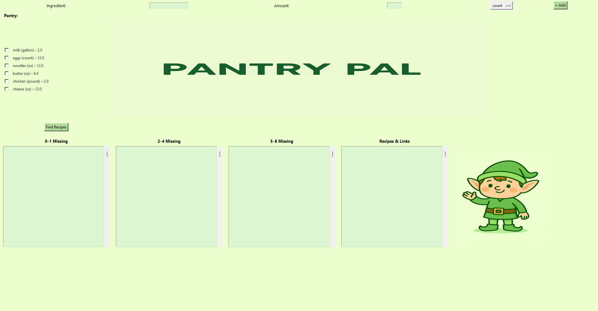

# Pantry-Based Meal Planner

This Python application helps users plan meals based on ingredients in their pantry. Using the Spoonacular API, it fetches real recipes and sorts them into categories depending on how many ingredients are missing. The app features a GUI for entering pantry items, saving/editing them, and browsing suggested recipes.

## Features

- Add, edit, and remove ingredients from your pantry
- Automatically categorize recipes into:
  - Exact or near-exact matches
  - Recipes missing 2–3 ingredients
  - Recipes missing 4–6 ingredients
- View recipe names and direct links to Spoonacular
- Save pantry across sessions
- Graphical user interface built with tkinter

## User Interface


## Technologies Used

- Python 3.x
- tkinter for GUI
- Spoonacular API for recipe data
- JSON for pantry storage

## Getting Started

1. **Clone the repository:**
   ```bash
   git clone https://github.com/dupreecaden/meal-planner.git
   cd meal-planner
